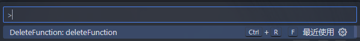

# [DeleteFunction](https://marketplace.visualstudio.com/vscode:extension/huangyuanyin.deleteFunction)

A simple vsCode plugin for quickly removing const and function function code blocks

## Installation

- Click on the Extensions icon (usually on the left-hand side of your editor).
- Search for "Delete Function".
- Find the extension in the list and click the install button.

## Usage

1. Through the Command Palette.

2. Through the shortcut

- default shortcut
  - mac："cmd + r + f"
  - win："ctrl + r + f"
